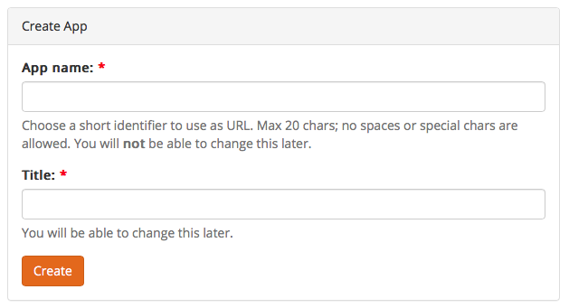
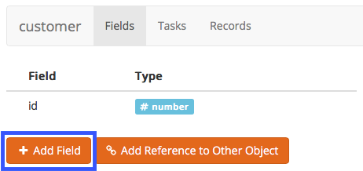
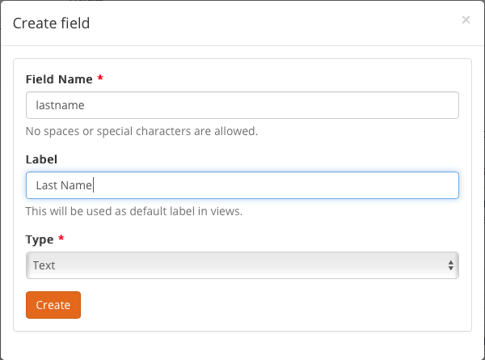

This tutorial will guide you throw the basic steps needed for creating your first app. The process is easy: first you define the objects that your app will handle, and then you build the pages that will let users browse and manipulate such data.

### Step one: give a name to your app

Just [enter Bobuild](https://my.bobuild.com) and click the "Create app" button.

Choose a short app name. This will be used as the app domain: `https://APPNAME.bobuild.com/`

Now you need to go through two steps:

1. Design your database
2. Design your application pages

## Design your database

This step is easy. You define the objects and the fields that you want to store in your database.

An object is just an entity: for example, `customer`, `product`, or `order`.

Start creating your objects by clicking the *Add Object* button:

You'll be prompted for the object name:

Now you need to define one or more object fields. Think about fields as the columns of a spreadsheet: they define the properties of your object. For example, a `customer` may have these fields: `name`, `lastname`, `address`, `email` and many more.
When you create an object, the `id` field will be created for you: it's a special field that you cannot change or delete. It's automatically populated with an incrementing number identifying the record uniquely.
Now add your first field by clicking the *Add Field* button:

You will be prompted for the field name and type. Choose the type that best describes the data you'll put in this field:

Repeat this step for all the desired fields.

Objects have relationships among them: each **order** belongs to a single **customer**, while each **product** may be associated with **multiple orders**.

